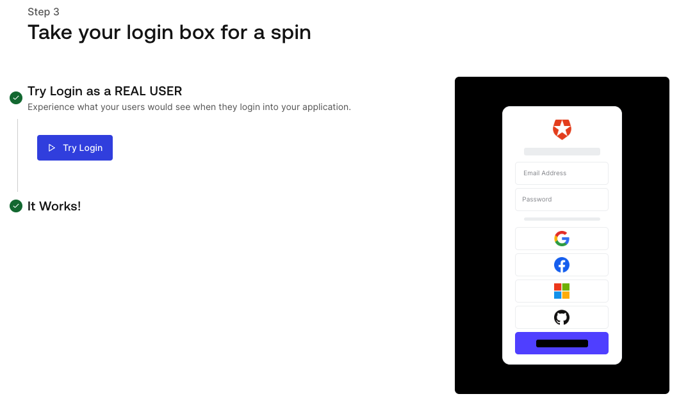
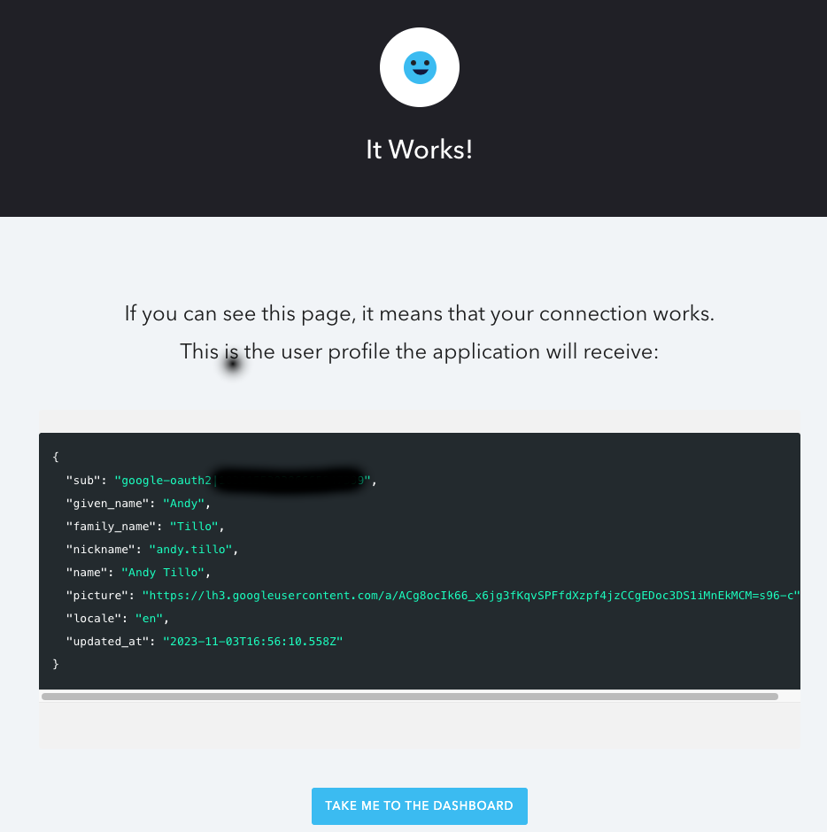
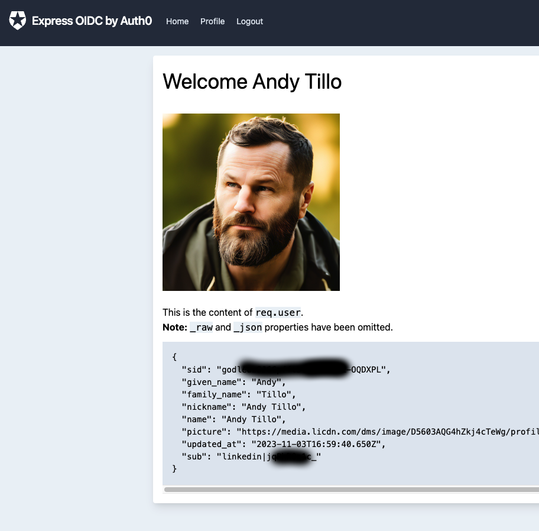
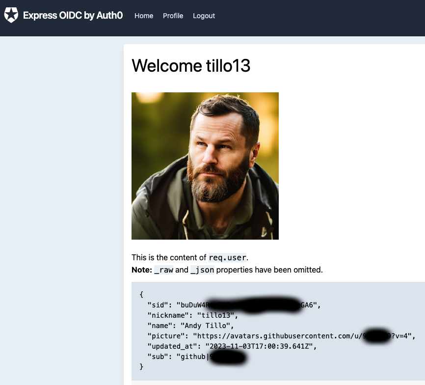

# Auth0 demo using Node.js for multiple endpoints

This repository showcases a customized Auth0 express.js application, based on the demo they have here [here](https://auth0.com/docs/package/v2?repo=auth0-express-webapp-sample&branch=master&path=01-Login).

The application packs an interactive authentication scheme where users can log in, log out, and view their profile via whatever auth endpoints to test out the functionality with detailed user information.

## First off, what is Auth0?

Auth0 helps you to easily:

- implement authentication with multiple identity providers, including social (e.g., Google, Facebook, Microsoft, LinkedIn, GitHub, Twitter, etc), or enterprise (e.g., Windows Azure AD, Google Apps, Active Directory, ADFS, SAML, etc.)
- log in users with username/password databases, passwordless, or multi-factor authentication
- link multiple user accounts together
- generate signed JSON Web Tokens to authorize your API calls and flow the user identity securely
- access demographics and analytics detailing how, when, and where users are logging in
- enrich user profiles from other data sources using customizable JavaScript rules

[Why Auth0?](https://auth0.com/why-auth0)

## Step 1: Setting Up the Application Locally/Getting Started

If you followed the step-by-step guide provided by Auth0, you might have chosen your own preferences, but for my setup, I decided to use Node.js on my MacBook. 

Here's the process I followed:

First, I went through the initial **Getting Started** introduction, designed to help new users understand and explore the core features of Auth0. After that, I was taken to the next screen that walked me through the step to *Create a Sample App*.

This walkthrough shows that we can create multiple applications under one Auth0 tenant—think of tenants as project areas within your Auth0 domain. The guide also reassures that this sample app can be deleted later if you decide you no longer need it. 

Choosing a platform for this demo, I went with the **Regular Web App**, which is a traditional web app that runs on the server.

Finally, I was prompted to select a technology for the app, and I picked **JS Express**.

Executing these choices successfully allowed me to experiment with the authentication box view/style. You can check out how it looked after successful login in the following screenshots:

- Initial Login Box:

  
- Successful Login:



### Step 2: Install Dependencies locally

Dependencies are several libraries or modules which our program depends on to function correctly. We retrieve these dependencies using the Node package manager, npm. 

If you haven't already installed npm, execute the following command:

```bash
npm install npm@latest -g
```

Then, navigate to your project folder (the folder where you have this application code stored on your local machine0: 

```bash
npm install morgan
```
The command `npm install morgan` specifically handles any logging errors our application might encounter, and actually the Auth0 demo didn't call this out, and I installed myself afterwards, your results may vary.

### Step 3: Configure your .env File

The `.env` file is a configuration file where we store our environment variables—variables that can be used across our application.  They say this data isn't necessarily private via Auth0, but good practices still to hide any proprietary things.

Rename the file `.env.example` to `.env` or make your own and provide the values for these variables:

- `CLIENT_ID` - This is the unique identifier for your Auth0 application you get from your app homepage in auth0.
- `ISSUER_BASE_URL` - The URL of your Auth0 application domain (For example: `https://accountName.auth0.com`).
- `SECRET` - This will be a randomly generated string for session encryption. Generate one in the command line with `openssl rand -hex 32`.

### Step 4: Acquire Auth0 Credentials

Acquiring Auth0 credentials— `CLIENT_ID` and `ISSUER_BASE_URL`— is straightforward. Simply access your Auth0 dashboard at https://manage.auth0.com/dashboard and select "Getting Started". 

If you're new to Auth0, a guide will appear automatically, leading you through the setup process. This process will guide you in creating a new application under your Auth0 tenant. Consider a tenant akin to an individual project area within your Auth0 domain.

Then you'll be prompted to choose the platform for the app. My personal preference was "Regular Web App", and I also went ahead with "JS Express" as my technology choice. Based on this choice the guide will suggest you download a sample application code, parallel to the one provided in this repository. Feel free to choose between the sample code or this repository, depending upon how you wish to proceed.

⚠️  **IMPORTANT!!!** While defining your application settings in the Auth0 dashboard, ensure you include `http://localhost:3000/callback` into the "Allowed Callback URLs" section. Additionally, specify `http://localhost:3000` in the "Allowed Logout URLs". Neglecting these settings could lead to hitches in navigation and operation within your application and likely lead to failure.

### Step 5: Ignite The App

With the setup now complete, it's time to kickstart our application. Navigate to your project folder and initiate the application by typing in the following command:

```bash
npm start
```

Voila! Your application is now up and running at `localhost:3000`. Open up a web browser and navigate to this URL. You will observe the login or logout options and can even view your profile details. 

For example, if you decide to log in through LinkedIn, it will look like this:


And if you opt to log out and log in again immediately via GitHub, it will resemble this:


**Congratulations** you now have a working Auth0 demo...

## License

This project is licensed under the MIT license. See the [LICENSE](LICENSE) file for more info.